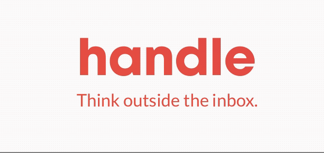

# Shift


[](http://cocoapods.org/pods/Pastel)
[](https://travis-ci.org/kgellci/Shift)
[](http://cocoapods.org/pods/Shift)
[](http://cocoapods.org/pods/Shift)
[](http://cocoapods.org/pods/Shift)




Inspired by Pastel: https://github.com/cruisediary/Pastel

Shift allows you to do gradient color animations on your UI using either a timed animation or the device tilting motion.

You can also easily mask the gradient animation to images or text.  Couple this with the motion based animation and 
you will get an effect similar to the Robinhood app.

## Example

To run the example project, clone the repo, and run `pod install` from the Example directory first.

```swift
let view = ShiftView()

// set colors
view.setColors([UIColor.orange,
UIColor.red,
UIColor.blue,
UIColor.purple])

// set animation duration
view.animationDuration(3.0)

// start animation
view.startTimedAnimation()

```

You can also start a motion based animation. The device accelerometer is used to shift the color as the device is tilted.
Note that accelerometers are not available is the simulator.

```swift
view.startMotionAnimation()
```

You can instantate a Button and animate the gradient color on the text only

This is similar to the gold reflection animations in the Robinhood app


```swift
let button = ShiftButton()
button.setTitle("Hello!", for: .normal)

// Custom gradient direction
button.start(shiftPoint: .topLeft)
button.end(shiftPoint: .bottomRight)

// Show the gradient on the text only
button.maskToText = true
button.startMotionAnimation()
```
Here is a list of available UI Classes

```swift
ShiftView()

// maskable to text or image
ShiftButton()

ShiftLabel()

// Maskable to text
ShiftMaskableLabel()

ShiftTextfield()

ShiftTextView()

// Maskable to image
ShiftImageView()
```

Each UI class has an Objective-C equivalent, just add _Objc to the class name, ShiftView_Objc

## Requirements

Swift 4.0, iOS 8.  Compatible with Obj-c

## Installation

Shift is available through [CocoaPods](http://cocoapods.org). To install
it, simply add the following line to your Podfile:

```ruby
pod "Shift"
```

## Author

kgellci, kgellci@gmail.com, @kgellci

## License

Shift is available under the MIT license. See the LICENSE file for more info.
